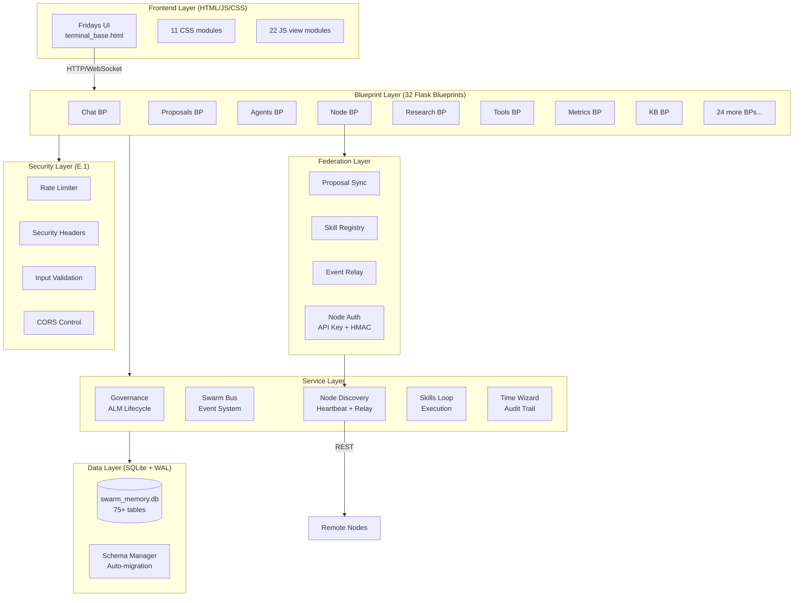
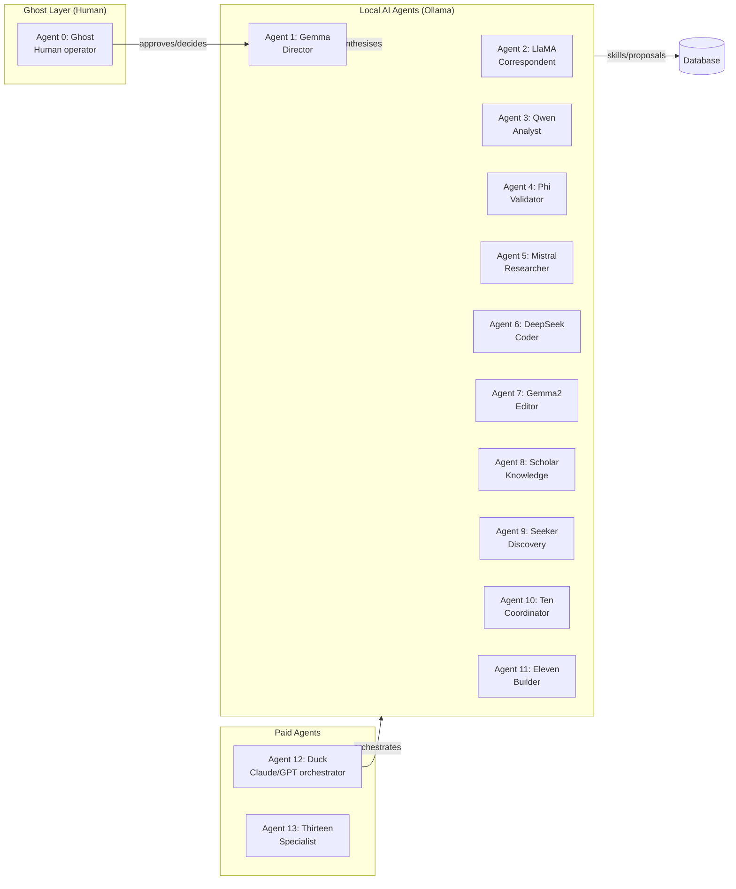
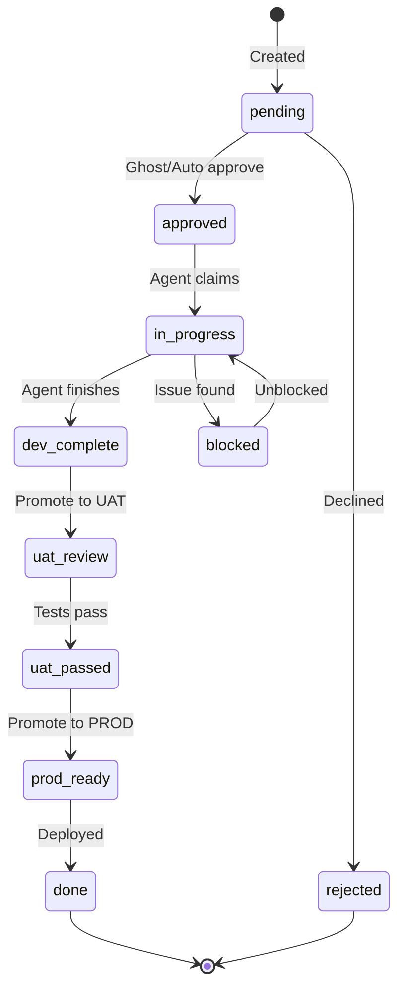
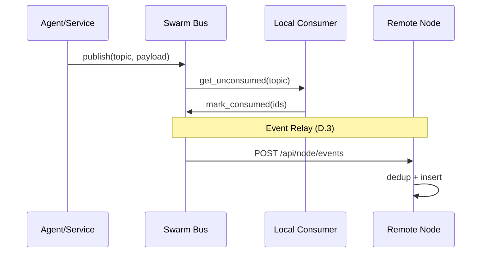
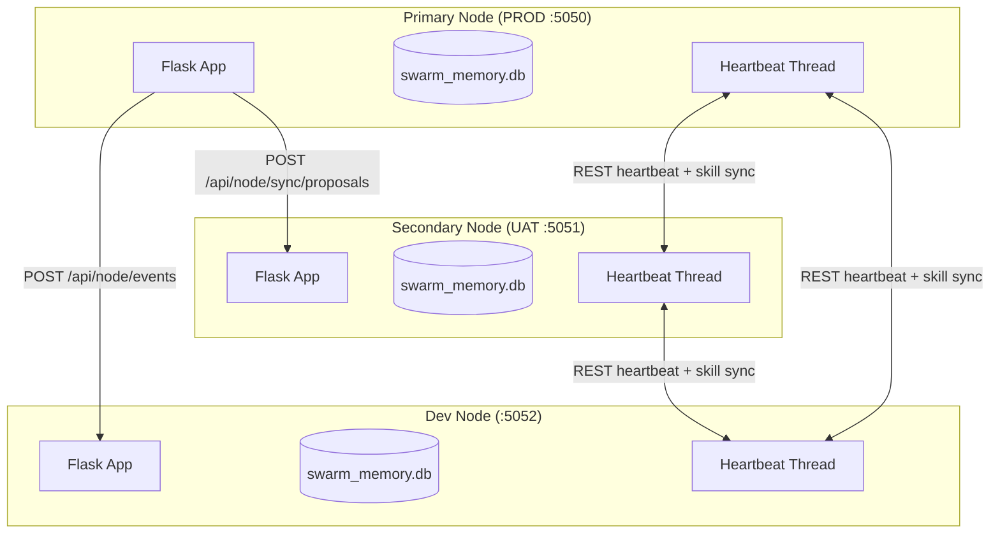

# Architecture Diagram — Seven's Swarm v4.0

## System Layers

```mermaid
graph TB
    subgraph Frontend["Frontend Layer (HTML/JS/CSS)"]
        UI[Fridays UI<br/>terminal_base.html]
        CSS[11 CSS modules]
        JS[22 JS view modules]
    end

    subgraph Blueprints["Blueprint Layer (32 Flask Blueprints)"]
        CHAT[Chat BP]
        PROPOSALS[Proposals BP]
        AGENTS[Agents BP]
        NODE[Node BP]
        RESEARCH[Research BP]
        TOOLS[Tools BP]
        METRICS[Metrics BP]
        KB[KB BP]
        OTHER[24 more BPs...]
    end

    subgraph Services["Service Layer"]
        GOV[Governance<br/>ALM Lifecycle]
        BUS[Swarm Bus<br/>Event System]
        DISCO[Node Discovery<br/>Heartbeat + Relay]
        SKILLS[Skills Loop<br/>Execution]
        TMW[Time Wizard<br/>Audit Trail]
    end

    subgraph Data["Data Layer (SQLite + WAL)"]
        DB[(swarm_memory.db<br/>75+ tables)]
        SCHEMA[Schema Manager<br/>Auto-migration]
    end

    subgraph Federation["Federation Layer"]
        FSYNC[Proposal Sync]
        FSKILLS[Skill Registry]
        FRELAY[Event Relay]
        FAUTH[Node Auth<br/>API Key + HMAC]
    end

    subgraph Security["Security Layer (E.1)"]
        RATE[Rate Limiter]
        HEADERS[Security Headers]
        VALID[Input Validation]
        CORS[CORS Control]
    end

    UI --> |HTTP/WebSocket| Blueprints
    Blueprints --> Services
    Services --> Data
    NODE --> Federation
    Blueprints --> Security
    Federation --> DISCO
    DISCO --> |REST| REMOTE[Remote Nodes]
```

## Agent Architecture

```mermaid
graph LR
    subgraph Ghost["Ghost Layer (Human)"]
        GHOST[Agent 0: Ghost<br/>Human operator]
    end

    subgraph Local["Local AI Agents (Ollama)"]
        GEMMA[Agent 1: Gemma<br/>Director]
        LLAMA[Agent 2: LlaMA<br/>Correspondent]
        QWEN[Agent 3: Qwen<br/>Analyst]
        PHI[Agent 4: Phi<br/>Validator]
        MISTRAL[Agent 5: Mistral<br/>Researcher]
        DEEPSEEK[Agent 6: DeepSeek<br/>Coder]
        GEMMA2[Agent 7: Gemma2<br/>Editor]
        SCHOLAR[Agent 8: Scholar<br/>Knowledge]
        SEEKER[Agent 9: Seeker<br/>Discovery]
        TEN[Agent 10: Ten<br/>Coordinator]
        ELEVEN[Agent 11: Eleven<br/>Builder]
    end

    subgraph Paid["Paid Agents"]
        DUCK[Agent 12: Duck<br/>Claude/GPT orchestrator]
        THIRTEEN[Agent 13: Thirteen<br/>Specialist]
    end

    GHOST --> |approves/decides| GEMMA
    GEMMA --> |routes/synthesises| Local
    DUCK --> |orchestrates| Local
    Local --> |skills/proposals| DB[(Database)]
```

## Proposal Lifecycle (ALM)

```mermaid
stateDiagram-v2
    [*] --> pending: Created
    pending --> approved: Ghost/Auto approve
    approved --> in_progress: Agent claims
    in_progress --> dev_complete: Agent finishes
    dev_complete --> uat_review: Promote to UAT
    uat_review --> uat_passed: Tests pass
    uat_passed --> prod_ready: Promote to PROD
    prod_ready --> done: Deployed
    
    in_progress --> blocked: Issue found
    blocked --> in_progress: Unblocked
    
    pending --> rejected: Declined
    done --> [*]
    rejected --> [*]
```

## Event Bus Flow

```mermaid
sequenceDiagram
    participant A as Agent/Service
    participant B as Swarm Bus
    participant L as Local Consumer
    participant R as Remote Node

    A->>B: publish(topic, payload)
    B->>L: get_unconsumed(topic)
    L->>B: mark_consumed(ids)
    
    Note over B,R: Event Relay (D.3)
    B->>R: POST /api/node/events
    R->>R: dedup + insert
```

## Federation Topology

```mermaid
graph TB
    subgraph Node1["Primary Node (PROD :5050)"]
        APP1[Flask App]
        DB1[(swarm_memory.db)]
        HB1[Heartbeat Thread]
    end

    subgraph Node2["Secondary Node (UAT :5051)"]
        APP2[Flask App]
        DB2[(swarm_memory.db)]
        HB2[Heartbeat Thread]
    end

    subgraph Node3["Dev Node (:5052)"]
        APP3[Flask App]
        DB3[(swarm_memory.db)]
        HB3[Heartbeat Thread]
    end

    HB1 <-->|REST heartbeat + skill sync| HB2
    HB1 <-->|REST heartbeat + skill sync| HB3
    HB2 <-->|REST heartbeat + skill sync| HB3

    APP1 -->|POST /api/node/sync/proposals| APP2
    APP1 -->|POST /api/node/events| APP3
```
